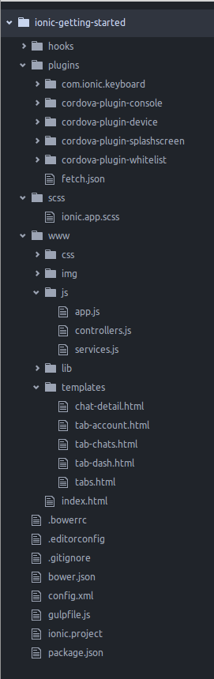
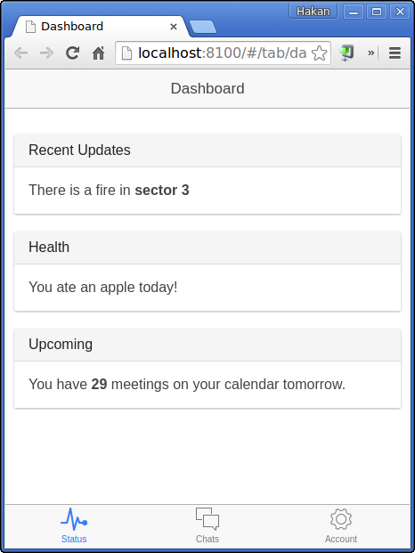

- npm ver: 1.3.10
- node ver: v0.10.25


 Install Ionic Framework via `npm`
 ---

On Linux:
```bash
sudo npm install -g ionic
```

On Windows:
```bash
npm install -g ionic
```

Install Cordova CLI
---

On Linux:
```bash
sudo npm install -g cordova
```

On Windows:
```cmd
npm install -g cordova
```
Create a seed project:
---

```bash
ionic start ionic-getting-started
```

Answer `n` to the following question indicating that you'll skip ionic.io cloud integration. We want to keep it simple here, right?

```
Create an ionic.io account to send Push Notifications and use the Ionic View app?
(Y/n): n
```
This will create the seed project:

<!--

-->



Running your app in browser
---

```bash
ionic serve
```

You'll see it in browser:

<!--

-->


Adding a target platform
---
Add a platform (ios or Android): ionic platform add ios [android]
  Note: iOS development requires OS X currently
  See the Android Platform Guide for full Android installation instructions:
  https://cordova.apache.org/docs/en/edge/guide_platforms_android_index.md.html

For iOS:
```
ionic platform add ios
```
For Android:
```
ionic platform add android
```

Running your app on a device
---
Run your app on a device: ionic run <PLATFORM>

For iOS:
```
ionic run ios
```
For Android:
```
ionic run android
```

Building your app
---
Build your app: ionic build <PLATFORM>
For iOS:
```
ionic build ios
```
For Android:
```
ionic build android
```

Running your app on an emulator
---
Simulate your app: ionic emulate <PLATFORM>

For iOS:
```
ionic emulate ios
```
For Android:
```
ionic emulate android
```
Note that Genymotion behaves like a device, so it requires `run` rather than `emulate`


Packaging your app
---
TODO:
* Package an app using Ionic package service: ionic package <MODE> <PLATFORM>
